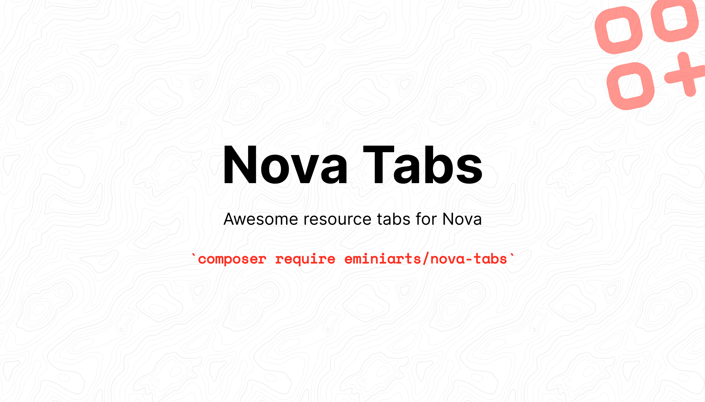

---

[](https://packagist.org/packages/eminiarts/nova-tabs)

1. [Requirements](#Requirements)
1. [Installation](#Installation)
2. [Usage](#Usage)
    1. [Tabs Panel](#tabs-panel)
    2. [Relationship Tabs](#relationship-tabs)
    3. [Combine Fields and Relations in Tabs](#combine-fields-and-relations-in-tabs)
    4. [Actions in Tabs](#actions-in-tabs)
    5. [Tabs on Edit View](#tabs-on-edit-view)
3. [Tab object](#tab-object)
4. [Customization](#customization)
    1. [Tab](#tab)
    2. [Default search](#default-search)
    3. [Display more than 5 items](#display-more-than-5-items)
    4. [Tab change Global Event](#tab-change-global-event)
5. [Upgrade to V2](#upgrade-to-v2)

## Requirements

- `php: ^7.4 | ^8`
- `laravel/nova: ^4`

For Laravel Nova Version 3, please use nova-tabs v1 instead.

## Installation

You can install the package in to a Laravel app that uses [Nova](https://nova.laravel.com) via composer:

```bash
composer require eminiarts/nova-tabs
```

## Usage

### Tabs Panel


You can group fields of a resource into tabs.

```php
// in app/Nova/Resource.php

use Eminiarts\Tabs\Traits\HasTabs;
use Eminiarts\Tabs\Tabs;
use Eminiarts\Tabs\Tab;

class User extends Resource
{
    use HasTabs;
    
    public function fields(Request $request)
    {
       return [
         Tabs::make('Some Title', [
            Tab::make('Balance', [
                Number::make('Balance', 'balance'),
                Number::make('Total', 'total'),
            ]),
            Tab::make('Other Info', [
                Number::make('Paid To Date', 'paid_to_date')
            ]),
         ]),
      ];
    }
 }
```

The first tab in every `Tabs` instance will be auto-selected. 

### Relationship Tabs


These are a bit outdated, as the search and create buttons now show within the panel down where the actual content is displayed, not in the tab panel.

```php
// in app/Nova/Resource.php

use Eminiarts\Tabs\Tabs;
use Laravel\Nova\Fields\HasMany;
use Eminiarts\Tabs\Traits\HasTabs;

class User extends Resource
{
    use HasTabs;
    
    public function fields(Request $request)
    {
        return [
           Tabs::make('Relations', [
                HasMany::make('Invoices'),
                HasMany::make('Notes'),
                HasMany::make('Contacts')
            ]),

        ];
    }
}
```

### Combine Fields and Relations in Tabs


```php
use Eminiarts\Tabs\Tabs;
use Laravel\Nova\Fields\HasMany;
use Eminiarts\Tabs\Traits\HasTabs;

use Laravel\Nova\Fields\ID;
use Laravel\Nova\Fields\Text;

class User extends Resource
{
    use HasTabs;
    
    public function fields(Request $request)
    {
          return [
              Tabs::make(__('Client Custom Details'), [
                  new Panel(__('Details'), [
                          ID::make('Id', 'id')->rules('required')->hideFromIndex(),
                          Text::make('Name', 'name'),
                  ]),
                  HasMany::make('Invoices')
              ]),
         ];
    }
}
```

### Actions in Tabs

If your Model uses the `Laravel\Nova\Actions\Actionable` Trait you can put the Actions into a Tab like this:

```php
// in app/Nova/Resource.php

use Eminiarts\Tabs\Tabs;
use Eminiarts\Tabs\Tab;
use Eminiarts\Tabs\Traits\HasTabs;
use Eminiarts\Tabs\Traits\HasActionsInTabs; // Add this Trait
use Laravel\Nova\Actions\ActionResource; // Import the Resource

class Client extends Resource
{
    use HasTabs;
    use HasActionsInTabs; // Use this Trait

    public function fields(Request $request)
    {
        return [
            Tabs::make('Client Custom Details', [
                Tab::make('Address', [
                    ID::make('Id', 'id'),
                    Text::make('Name', 'name')->hideFromDetail(),
                ]),
                Tab::make('Invoices', [
                    HasMany::make('Invoices'),
                ]),
                Tab::make('Actions', [
                    $this->actionfield(), // Add Actions whererver you like.
                ]),
            ]),
        ];
    }
}
```

### Tabs on Edit View


Tabs are always shown on edit view as of Nova 4 for now.

## Tab object

As of v1.4.0 it's possible to use a `Tab` class instead of an array to represent your tabs.

| Property    | Type                | Default     | Description                                                                                                                                                            |
|-------------|---------------------|-------------|------------------------------------------------------------------------------------------------------------------------------------------------------------------------|
| name        | `string`            | `null`      | The name of the tab, used for the slug.  Defaults to the title if not set                                                                                              |
| showIf      | `bool` or `Closure` | `null`      | If the result is truthy the tab will be shown.  `showIf` takes priority over `showUnless` and if neither are set, `true` is assumed.                                   |
| showUnless  | `bool` or `Closure` | `null`      | If the result is falsy the tab will be shown.  `showIf` takes priority over `showUnless` and if neither are set, `true` is assumed.                                    |
| bodyClass   | `string` or `array` | Empty array | A string or string array of classes to add to the tab's body.  This sets the `bodyClass` property, if you want to append you can use `addBodyClass` instead.           |

## Customization

### Display more than 5 items

By default, any `HasMany`, `BelongsToMany` and `MorphMany` fields show 5 items in their index. You can use Nova's built-in static property `$perPageViaRelationship` on the respective resource to show more (or less).

### Tab change Global Event

Nova Tabs emits an event upon tabs loading and the user clicking on a tab, using [Nova Event Bus](https://nova.laravel.com/docs/4.0/customization/frontend.html#event-bus). Developers can listen to the event called ```nova-tabs-changed```, with 2 parameters as payload: The tab panel name and the tab name itself.

Example of a component that subscribes to this event:

```ES6
export default {
    mounted () {
        Nova.$on('nova-tabs-changed', (panel, tab) => {
            if (panel === 'Client Details' && tab === 'address') {
                this.$nextTick(() => this.map.updateSize())
            }
        })
    }
}
```

## Upgrade to 2.0.0
- Breaking changes
   - Removed selectFirstTab, first tab is always displayed first.
   - Even if you have other panels, tabs will always show up first and has the toolbar.
   - TabsOnEdit is gone and non relational tabs will simply always display on edit.
   - I don't use dusk, so didn't check the tests for it either, they might be broken.
   - Added Eminiarts\Tabs\Traits\HasTabs to overwrite Nova 4 default panel methods in Laravel\Nova\ResolveFields.
   - Moved Eminiarts\Tabs\ActionsInTabs to Eminiaarts\Tabs\Traits\HasActionsInTabs.
   - Added position method to Tab to fix relational tabs showing up last.

## Credits
Banner was created with https://banners.beyondco.de/
